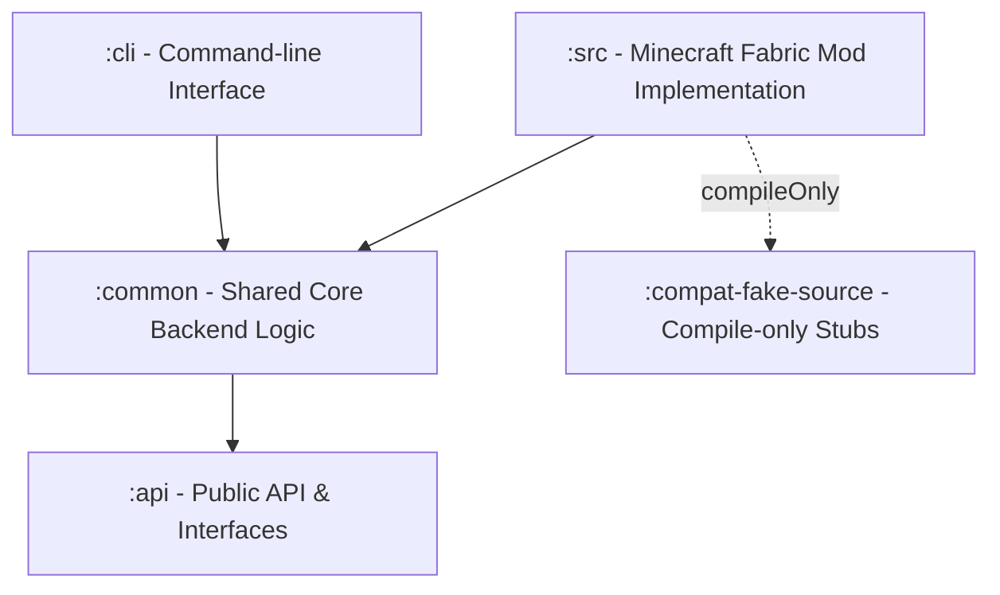
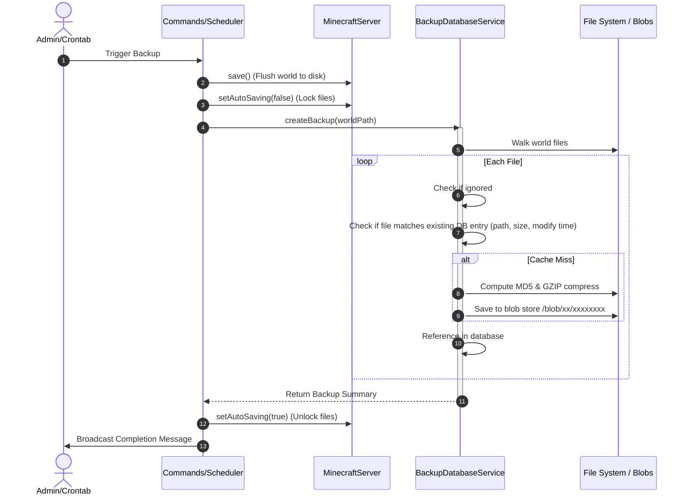
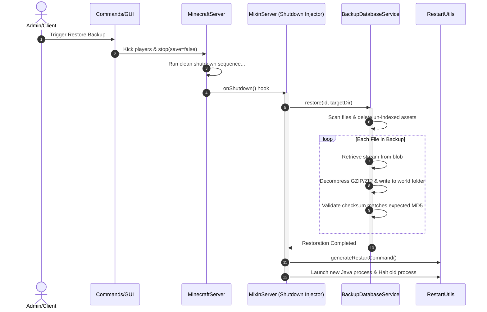

# X Backup Architectural Map

This document maps out the architecture, module layout, file dependencies, and execution flow of the **X Backup** Minecraft mod (designed for Minecraft 1.21.11, with cross-version support managed via Stonecutter).

---

## 1. Project Organization (Gradle Modules)

The project is structured as a multi-module Gradle build:

*   **`:api`**: Defines interface boundaries. It holds no external dependencies other than Kotlin/Java standards, allowing other mods to interact with X Backup without importing Exposed or Ktor.
*   **`:common`**: The functional heart. Handles file walking, hashing, deduplication database (SQLite), and configuration settings.
*   **`:compat-fake-source`**: A compilation-helper module containing empty stubs of third-party libraries (like LuckPerms, fabric-permissions-api, and net.minecraft classes). This permits conditional compiles without declaring heavy transitive dependencies.
*   **`:cli`**: A standalone terminal tool. Admins can run this inside a world directory to list, back up, or restore worlds entirely offline.
*   **`:src` (Main Mod)**: Extends `:common` to tie into the Fabric/Minecraft lifecycle, adding game commands, user interfaces, mixins, and network integrations (OneDrive).

---

## 2. File-by-File Breakdown & Interactions

### A. The API Module (`:api`)
*   [XBackupApi.java](file:///e:/x-backup/api/src/main/java/com/github/zly2006/xbackup/api/XBackupApi.java): Serves as the static entry point hook (`getInstance`/`setInstance`). Exposes high-level methods to request backups, check integrity, delete backups, or restore targets.
*   [IBackup.kt](file:///e:/x-backup/api/src/main/java/com/github/zly2006/xbackup/api/IBackup.kt) & [IBackupEntry.kt](file:///e:/x-backup/api/src/main/java/com/github/zly2006/xbackup/api/IBackupEntry.kt): Immutable data contracts representing a completed backup metadata envelope and the individual files indexed within it.
*   [CloudStorageProvider.kt](file:///e:/x-backup/api/src/main/java/com/github/zly2006/xbackup/api/CloudStorageProvider.kt): Interface defining asynchronous cloud upload triggers and speed telemetry hooks.
*   [XBackupKotlinAsyncApi.kt](file:///e:/x-backup/api/src/main/java/com/github/zly2006/xbackup/api/XBackupKotlinAsyncApi.kt): Provides Kotlin coroutine extensions (like `suspend fun restore`) and raw SQLite database transaction hooks (`dbQuery`).

### B. The Common Backend Module (`:common`)
*   [BackupDatabaseService.kt](file:///e:/x-backup/common/src/main/kotlin/com/github/zly2006/xbackup/BackupDatabaseService.kt):
    *   **Responsibility**: Implements `XBackupKotlinAsyncApi`. Connects to the SQLite database via JetBrains Exposed.
    *   **Key Logic**:
        *   *Content-Addressable Storage (CAS)*: Walks files, computes MD5 hashes, and compresses newly encountered files into the GZIP/ZIP blob store. Relies on `BackupEntryTable`, `BackupTable`, and `BackupEntryBackupTable` to achieve perfect file-level deduplication.
        *   *Restoration*: Compares target directory state with database indexes, deletes un-indexed files, and streams blobs back to disk while checking MD5 integrity.
        *   *GC/Packing*: Bundles files smaller than 50MB into joint Zip files to keep file system inode counts low, and garbage-collects orphaned blobs (`deleteUnusedBlobs`).
*   [Config.kt](file:///e:/x-backup/common/src/main/kotlin/com/github/zly2006/xbackup/Config.kt): Configures backup intervals, cloud API tokens, and lists file exclusions. Implements a custom cron-like Grandfather-Father-Son (GFS) pruning evaluator to keep older backups progressively sparser.
*   [I18n.kt](file:///e:/x-backup/common/src/main/kotlin/com/github/zly2006/xbackup/I18n.kt): Resolves translation JSON resources (`en_us.json`, `zh_cn.json`) for chat prompts and command errors.

### C. The Main Mod Module (`:src`)
*   [XBackup.kt](file:///e:/x-backup/src/main/kotlin/com/github/zly2006/xbackup/XBackup.kt):
    *   **Responsibility**: Main Fabric `ModInitializer`.
    *   **Interactions**: Hooks into server startup (`SERVER_STARTED`) to initialize `BackupDatabaseService` pointing to the world's database, spins up the background auto-backup crontab coroutine thread, and registers `/xb` command handlers.
*   [Commands.kt](file:///e:/x-backup/src/main/kotlin/com/github/zly2006/xbackup/Commands.kt):
    *   **Responsibility**: Registers `/xb` command dispatch trees (create, list, info, restore, prune, debug).
    *   **Interactions**: Interacts with the `BackupDatabaseService` to trigger backups, and controls Minecraft servers (e.g., saving worlds, stopping watchdogs, and launching restores). Supports regional restores by checking coordinates inside chunk region files (`.mca`/`.mcc`).
*   [RestartUtils.kt](file:///e:/x-backup/src/main/kotlin/com/github/zly2006/xbackup/RestartUtils.kt): Evaluates Java Runtime Management parameters to generate a native command to hot-restart the JVM (on Linux/macOS/Windows) when restoring worlds.
*   [cloud/OnedriveSupport.kt](file:///e:/x-backup/src/main/kotlin/com/github/zly2006/xbackup/cloud/OnedriveSupport.kt): Implements chunk-based uploading (10MB slices) to OneDrive using Ktor and RedenMC API proxies. Writes upload state to `.tmp/xb.upload.json` so interrupted transfers can resume seamlessly.
*   [gui/BackupsGui.kt](file:///e:/x-backup/src/main/kotlin/com/github/zly2006/xbackup/gui/BackupsGui.kt): Extends PolyLib's modular screen system. Extracts `icon.png` from backup archives and uploads them dynamically as textures to list backups visually in the Singleplayer Select World menu.

---

## 3. Core Execution Flow Diagrams

### A. Backup Creation Process

### B. Restore Process (Safely Off-thread)
Because you cannot overwrite active Minecraft region files while the game is running, X Backup intercepts the shutdown loop to perform restorations.

---

## 4. Third-Party Library & Build Dependencies

Dependencies are declared globally in `gradle.properties` and resolved contextually inside `build.gradle.kts`:

| Dependency | Purpose | Scope | Notes |
| :--- | :--- | :--- | :--- |
| **Fabric Loom** | Compilation environment and Loom mappings | Build system | Handles Yarn mappings and decompilers |
| **Stonecutter** | Multi-version compilation framework | Build system | Evaluates conditional statements in code |
| **Fabric Language Kotlin** | Kotlin standard libraries loading in MC | Runtime & compile | Direct loader dependency |
| **JetBrains Exposed** (`exposed-version`) | SQL ORM library | Shadowed & compiled | Handles connection pooling and queries |
| **SQLite-JDBC** | Database driver for SQLite | Shadowed & compiled | Drives local `x_backup.db` storage |
| **Ktor Client** (`ktor_version`) | HTTP requests & Serialization | Shadowed & compiled | Drives OneDrive upload communications |
| **PolyLib** (`deps.poly_lib`) | Client Modular GUI controls | CompileOnly/Optional | Enables the "回" backup button in Singleplayer |
| **LuckPerms / Perms API** | Permission validation | CompileOnly | Extracted from `compat-fake-source` |
